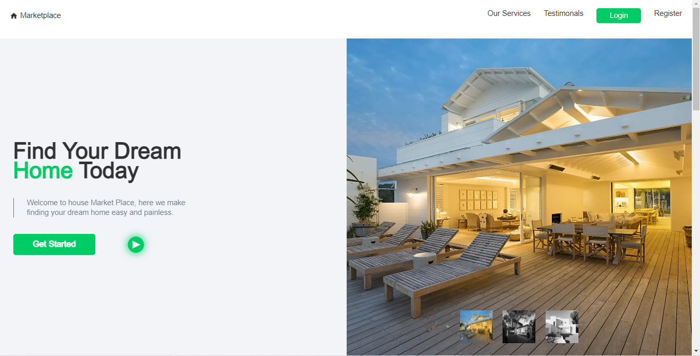
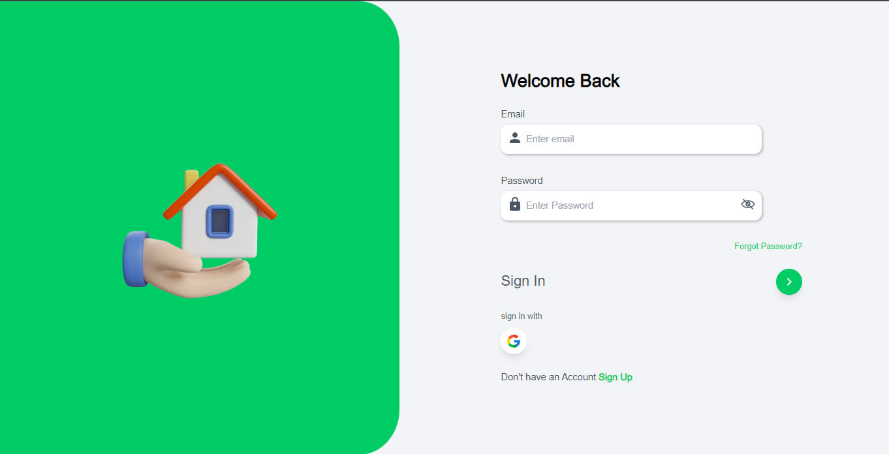
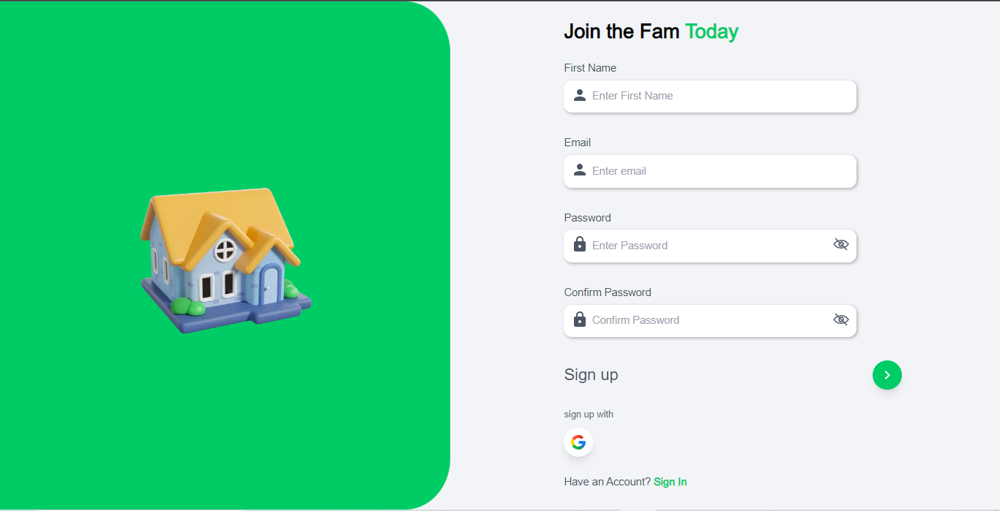
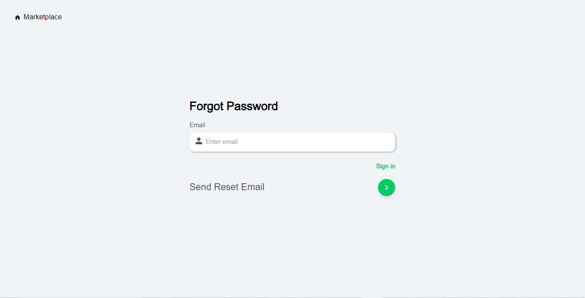
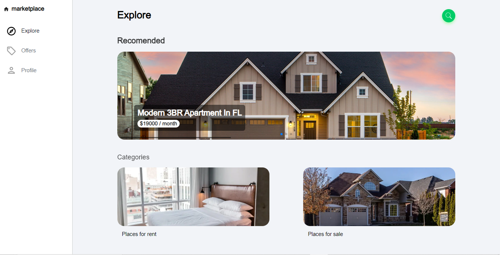
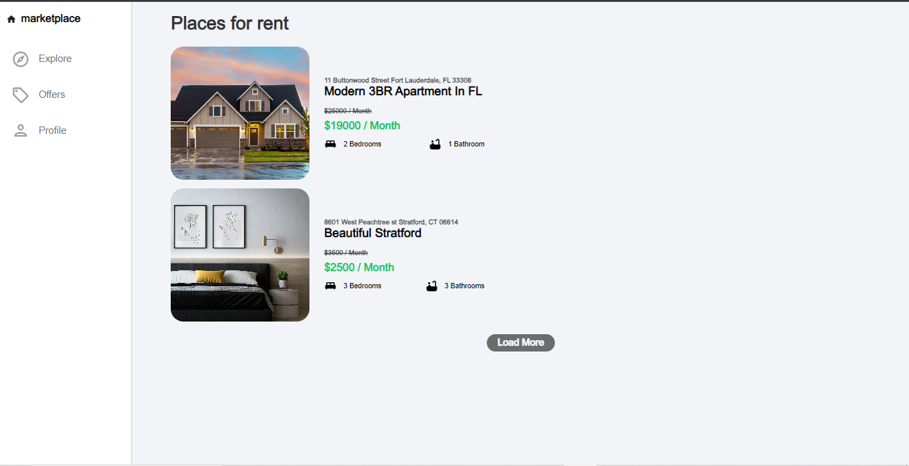
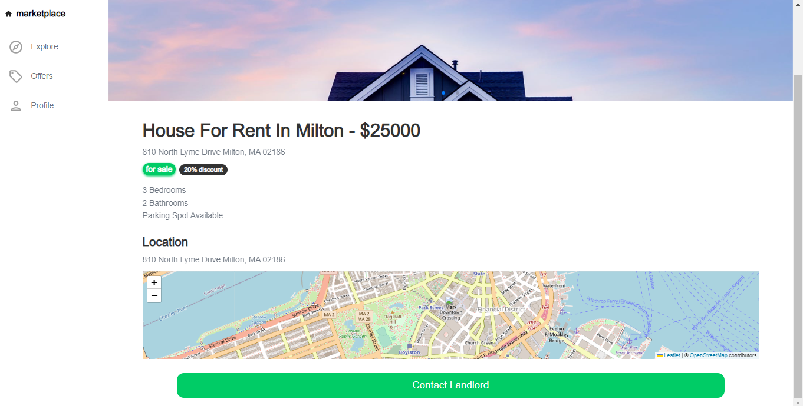
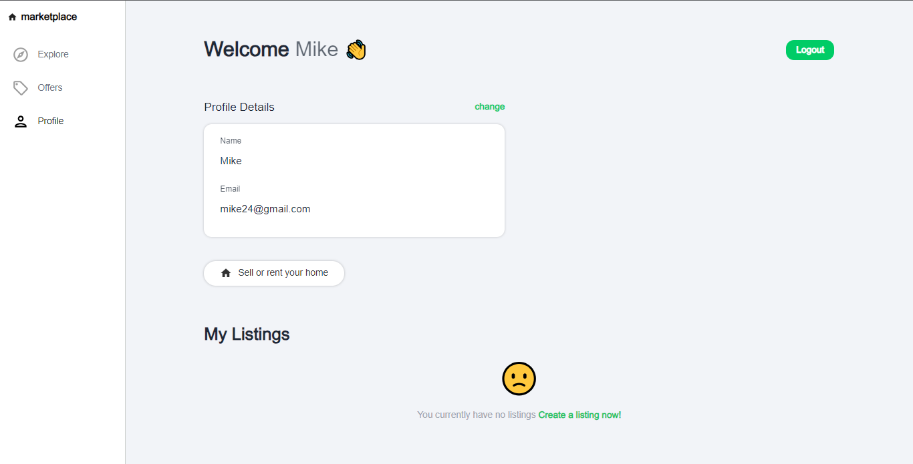

# House MarketPlace 

A Web Application to purchase houses all over the world.


<div align="center">
    <a href="#">View Demo</a>
  <span> · </span>
    <a href="https://github.com/Nathan-Somto/house-marketplace/blob/main/README.md">Documentation</a>
  <span> · </span>
    <a href="https://github.com/Nathan-Somto/house-marketplace/issues">Report Bug</a>
  <span> · </span>
    <a href="https://github.com/Nathan-Somto/house-marketplace/pulls">Request Feature</a>
  </div>

## Status
Application will be deployed as soon as all bugs have been fixed.

## Tech-Stack

### Front-End
- Next js (13.4.3)(Pages Router) (React Framework)
- React   (18) (UI library)
- Tailwind Css (Css Framework)
- Framer motion (Animation Library)
- React Hook Form (Form Validation Library)
- Leaflet (For Map Display Functionality)
- Aos (For Scrolling Animation) (TBH hope they update the package.)
- Typescript (Programming Language)
- Zustand (State Management Library)
- React Toastify (For Toast Alerts)

### Back-End

- Firebase (Baas)
- Cloud Firestore (Real time Db)
- Firebase Storage (File Storage)
- Open Weather Map Geocoding Api (Gecodes a given Location.)

## Screenshots

### Home Page


### Login Page


### Register Page


### Forgot Password Page


### Explore Page


### Rent Page


### Listing Details


### Profile


*Like how the Application looks*
[See it Live](https://theHostedLink.com)
## Reason For Project

This project was inspired by the `React front to back` course by brad traversy on udemy.
This is a rebuild of his house marketplace project in my favourite tech stack.
I wanted to use this project to learn Next js.
**Note there are a few improvements to his original Project**

### Why didn't i use the App router?

> For some reason whenever i develop with the app router it takes alot of `RAM` which makes DX very poor.
> so for now until i get a new system all my Next js projects will be in the page router.
> When i do get a new system , i will migrate my code to the  App router.

## Installation
- [ ] Clone the Repository  

```
    $ git clone https://github.com/nathan-somto/house-marketplace.git
```

- [ ] Enter into the directory

```
    $ cd house-marketplace
```

- [ ] Install all dependencies

```
   $ npm install
```

- [ ]  Start the Development Server

```
    $ npm run dev
```
### Environment Variables

`NEXT_PUBLIC_GEOCODE_KEY`

## Acknowledgements
[Brad Traversy](https://github.com/) - How to start the project and create firebase rules.
[ChatGpt]() - Helped to fix my bugs.
[NextJs Docs]() - Helped me to understand how to use the page router.

## Contributors
[Nathan-Somto](https://github.com/Nathan-Somto.com);